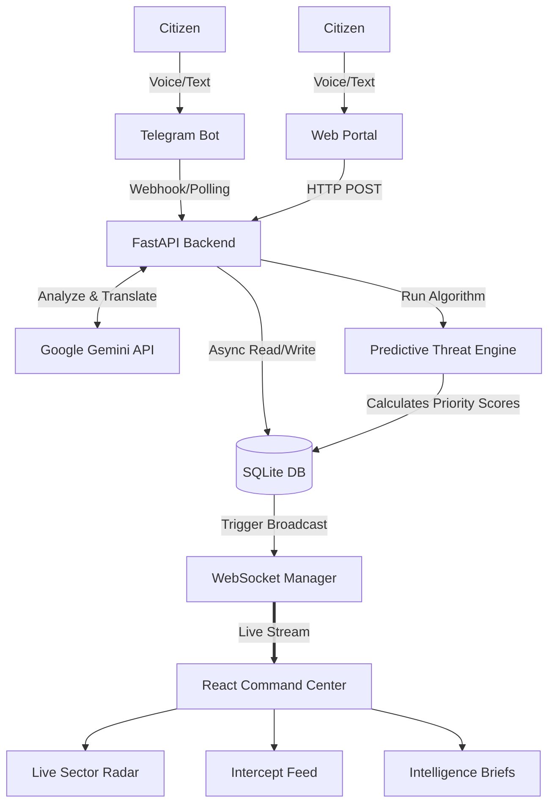

<div align="center">
  
# 🏛️ JanSetu AI 
**AI-Powered Predictive Civic Intelligence & Resource Routing Command Center**

[]()
[]()
[]()
[]()

*Built for the **Code for Communities** Hackathon.*

</div>

---

## 🚀 The Vision
In rapidly growing nations, government infrastructure spending is often reactive. Civic authorities struggle with data silos, language barriers, and a lack of real-time prioritization. 

**JanSetu AI** ("People's Bridge") is an enterprise-grade civic intelligence platform. It ingests omni-channel citizen feedback in any regional language (via Telegram or Web), uses Google Gemini AI to analyze urgency and sentiment, and dynamically routes predictive "Threat Scores" to a real-time, WebSockets-powered Command Center for government officials.

## ✨ Core Capabilities
- 🌍 **Omni-Channel & Multilingual Ingestion:** Citizens can type or send voice notes in any language via a Web Portal or the official Telegram Bot.
- 🧠 **Gemini-Powered Intelligence:** Automatically translates regional languages to English, categorizes the issue (Water, Roads, Healthcare), and scores the Urgency and Sentiment.
- ⚡ **Real-Time WebSocket Radar:** Live dashboard updates instantly without page refreshes, plotting geospatial anomalies on a Google Maps radar.
- 📊 **Predictive Threat Engine:** A proprietary algorithm cross-references real-time complaints with historical census and infrastructure gap data to calculate a 0-100 Priority Action Score per district.
- 📑 **Automated Policy Briefs:** Instantly generates boardroom-ready PDF Intelligence Briefs using automated AI synthesis.

---

## 🏗️ System Architecture



---

## 🛠️ Tech Stack
| Component | Technology |
| --- | --- |
| **Frontend** | React 18, Vite, Tailwind CSS, Framer Motion, Recharts |
| **Mapping** | `@vis.gl/react-google-maps` (Google Maps JS API) |
| **Backend** | Python 3.10+, FastAPI, Uvicorn, WebSockets |
| **Database** | AioSQLite (Asynchronous SQLite) |
| **AI/ML Engine** | `google-genai` (Gemini 3.8 Flash API) |
| **Bot Integration**| `python-telegram-bot` (v20+) |

---

## 🚦 Local Setup & Installation

### 1. Clone & Environment Setup
Clone the repository and install dependencies for both the frontend and backend.
```bash
git clone https://github.com/your-username/jansetu-ai.git
cd jansetu-ai

# Setup Python Backend
python -m venv venv
source venv/bin/activate  # On Windows use: .\venv\Scripts\activate
pip install -r requirements.txt

# Setup React Frontend
cd frontend
npm install
```

### 2. Environment Variables
Create a `.env` file in the root directory (`jansetu-ai/.env`) and add your API keys:
```env
# Google Gemini AI Key
GEMINI_API_KEY=your_gemini_api_key_here

# Telegram Bot Token (from BotFather)
TELEGRAM_BOT_TOKEN=your_telegram_token_here

# Google Maps API Key (For the Live Radar)
VITE_GOOGLE_MAPS_API_KEY=your_google_maps_key_here

# Backend URL for Vite
VITE_API_URL=http://localhost:8000
```

### 3. Running the Stack (3-Terminal Architecture)
To ensure the Telegram bot and FastAPI server do not block the event loop, the application is divided into three dedicated micro-services. Open 3 separate terminal windows:

**Terminal 1: Start the Core API Server**
```bash
cd jansetu-ai
.\venv\Scripts\activate
python run_backend.py
```

**Terminal 2: Start the Telegram Bot Engine**
```bash
cd jansetu-ai
.\venv\Scripts\activate
python run_bot.py
```

**Terminal 3: Start the React Frontend**
```bash
cd jansetu-ai/frontend
npm run dev
```

The Command Center will now be live at `http://localhost:5173`. 

---

## 📱 How to Test
1. Open the Dashboard at `http://localhost:5173`.
2. Open Telegram and message your bot with a civic complaint (e.g., *"Medical supplies are running out at the local clinic"*).
3. Watch the dashboard update **instantly in real-time** via WebSockets without refreshing the page!

<br>
<div align="center">
  <i>Developed with ❤️ for the Code for Communities Hackathon</i>
</div>
